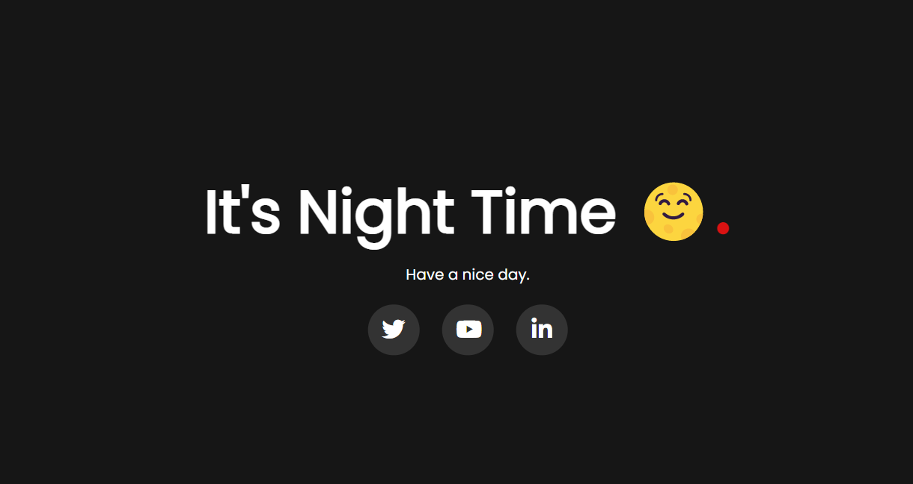

# Predicting-Day-and-Night

I've considered 06:01 am to 6:59 pm as day time and rest as night time.

<a href="https://swarnadeep08.github.io/Predicting-Day-and-Night/">

In order to change time, click on the search button and type 'Date & time'. If the time is set automatically, turn it off and change the time manually.

